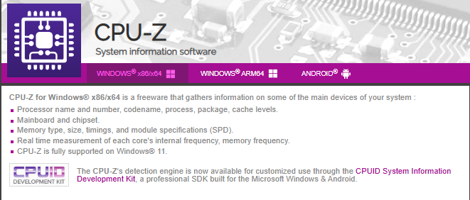
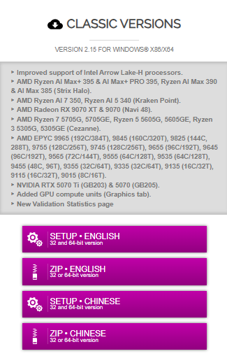

## CPU-Z - Guía de Uso 🔧

### 1.Introducción

**CPU-Z** es una aplicación para Windows la cual permite analizar en detalle el hardware y el sistema operativo de un equipo, proporcionando información técnica precisa sobre sus componentes. Esta herramienta es especialmente útil para conocer las características del procesador, incluyendo su modelo, arquitectura, velocidad de reloj, número de núcleos e hilos, memoria caché y tecnología de fabricación.

Además, CPU-Z ofrece datos sobre la memoria RAM, como su tipo, capacidad, frecuencia y configuración en doble canal, así como información sobre la placa base, el chipset y la tarjeta gráfica. Gracias a su análisis en tiempo real, resulta indispensable para administradores de sistemas y técnicos en soporte informático que necesiten diagnosticar el hardware sin necesidad de desmontar el equipo. También es una herramienta clave para realizar overclocking, ya que permite monitorizar la estabilidad y rendimiento del sistema tras modificar parámetros de frecuencia y voltaje.

## 2.Descarga e Instalación de la Herramienta

Para instalar esta herramienta, primero debemos acceder a la página oficial de [CPU-Z](https://www.cpuid.com/softwares/cpu-z.html).Una vez en el sitio web, descargaremos la versión **"Classic Version Setup"** .

 Tras completar la descarga, ejecutaremos el archivo de instalación y seguiremos los pasos del asistente, configurándolo según nuestras preferencias. Durante el proceso, el asistente nos solicitará:

* Seleccionar el idioma
* Aceptar los términos de uso
* Elegir la ubicación de instalación

## 3.Uso Básico

Dentro de CPU-Z encontraremos varias pestañas, cada una de las cuales proporciona información detallada sobre diferentes componentes del sistema. A continuación, se describen las principales pestañas y los datos que ofrecen...

---

**1. Información del Procesador**

El procesador es el componente principal de un ordenador, y CPU-Z proporciona datos detallados sobre su funcionamiento en la pestaña **"CPU"** .

* **Nombre y modelo** : Identifica el fabricante y generación .
* **Velocidad** : Frecuencia base y turbo .
* **Arquitectura** : Tecnología  y conjunto de instrucciones (AVX, SSE).
* **Caché** : Niveles L1, L2, L3 .

---

**2. Informacion de la Placa Base**

En la pestaña **"Mainboard"** , CPU-Z proporciona detalles sobre la placa base, como es:

* **Fabricante y modelo**
* **BIOS** : Versión y fecha (importante para actualizaciones de seguridad).
* **Chipset** : Controla buses como PCIe y USB.

---

**3. Informacion de la Memoria RAM ("Memory")**

Para visualizar la información de la memoria RAM, accede a la pestaña **"Memory"** . En esta sección se muestra:

* **Tipo y tamaño** : DDR4/DDR5 y capacidad total.
* **Frecuencia** : Velocidad real.
* **Modo de canal** : Dual/Quad Channel para mayor ancho de band

---

**4. Detalles por Módulo de RAM ("SPD")**

La pestaña **SPD** proporciona detalles técnicos sobre cada módulo de memoria RAM instalado en el sistema. Esta información es útil para conocer las especificaciones exactas y las capacidades de la memoria.

* **Datos por ranura** : Selecciona cada slot (DIMM) para ver su información.
* **Fabricante y modelo** : Identifica la marca .
* **Perfiles XMP/EXPO** : Muestra velocidades preconfiguradas para overclocking.
* **Timings** : Latencia CAS , tRCD, tRP

---

**5. Información de la Tarjeta Gráfica ("Graphics")**

La pestaña **Graphics** muestra información detallada sobre la GPU instalada, permitiendo verificar sus características y estado de funcionamiento.

* **Modelo y fabricante** : Identifica si es NVIDIA, AMD o Intel.
* **Frecuencias** : Velocidad del núcleo (GPU Clock) y memoria (Memory Clock).
* **Memoria** : Tipo, tamaño y ancho de banda.
* **Versión del driver** : Útil para verificar actualizaciones.

---

**6. Benchmark y Rendimiento ("Bench")**

La pestaña **Bench** permite evaluar el rendimiento del CPU y compararlo con otros modelos:

* **Prueba de estrés (Stress CPU)** : Mide estabilidad bajo carga máxima.
* **Puntuación de referencia (Single/Multi-Core)** : Compara tu CPU con otros .
* **Opción "Threads"** : Permite probar todos los núcleos o solo uno.

---

Espero que esta guia de como instalar CPU-Z te haya resultado útil, tal y como es esta herramienta!!!! 🚀🔧

