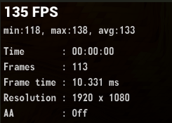
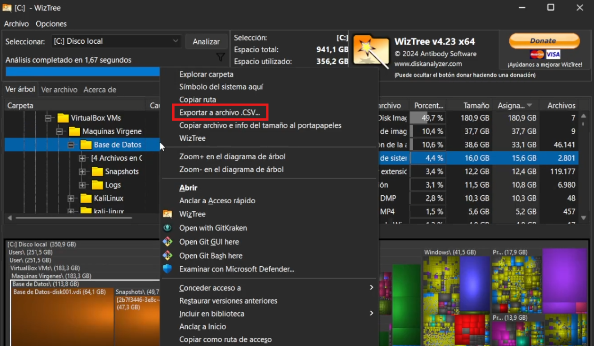

## WizTree - Guía de Uso 🔧

### 1. Introducción

**WizTree** es una aplicación para Windows que permite analizar y visualizar el uso del espacio en discos duros (HDD) y unidades de estado sólido (SSD). Su principal ventaja es su velocidad, ya que escanea discos en segundos utilizando directamente la información del sistema de archivos NTFS.

Con **WizTree**, los usuarios pueden identificar archivos y carpetas que ocupan más espacio, facilitando la optimización y limpieza del almacenamiento. Su interfaz muestra los datos en listas detalladas y gráficos tipo "treemap", lo que permite localizar archivos grandes de manera intuitiva.

## 2.Descarga e Instalación de la Herramienta

Para instalar esta herramienta, primero debemos acceder a la página oficial de [WizTree](https://diskanalyzer.com/).Una vez en el sitio web, descargaremos la versión más reciente disponible.

Tras completar la descarga, ejecutaremos el archivo de instalación y seguiremos los pasos del asistente, configurándolo según nuestras preferencias. Durante el proceso, el asistente nos solicitará:

- Seleccionar el idioma
- Aceptar los términos de uso
- Elegir la ubicación de instalación

## 3.Uso Básico de WizTree

Una vez instalado, **WizTree** permite analizar el espacio en disco de manera rápida y sencilla. A continuación, se detallan los pasos básicos para utilizar la herramienta:

---

**1. Iniciar WizTree**

Abrimos la aplicación y selecciona la unidad de disco que deseamos analizar.

---

**2. Escanear el Disco**

En la parte superior de la ventana, encontraremos un menú desplegable donde podemos elegir el disco que deseas analizar. Hacemos clic en el botón **"Scan"**. Si el disco está en formato **NTFS**, el escaneo será casi instantáneo, ya que WizTree leerá directamente la tabla maestra de archivos (MFT).

---

**3. Explorar los Resultados**

Al seleccionar la unidad que deseamos analizar, haz clic en el botón **"Scan"** para iniciar el proceso. Si el disco está formateado en **NTFS**, el escaneo será extremadamente rápido, ya que **WizTree** utiliza la **Tabla Maestra de Archivos (MFT)** para leer la estructura del disco de manera directa. Si el disco está en formatos como **FAT** o **exFAT**, el análisis tomará más tiempo, ya que **WizTree** debe explorar el contenido carpeta por carpeta.

- **Lista de archivos y carpetas**: Ordenados por el espacio que ocupan.
- **Gráfico "Treemap"**: Representación visual con bloques que indican el tamaño relativo de cada archivo o carpeta.
- **Lista de tipos de archivos**: Clasificación por extensiones para identificar qué tipos de archivos ocupan más espacio.

---

**4. Buscar Archivos Específicos**

Si necesitamos encontrar un archivo específico, podemos usar la barra de búsqueda que aparece en la parte superior de la ventana. Solo tienemos que escribir el nombre del archivo o la extensión, y WizTree mostrará los resultados de manera instantánea.

---

**5. Eliminar Archivos y Carpetas**

Una vez que hayamos identificado archivos o carpetas que ocupan demasiado espacio y ya no necesitamos, puedes eliminarlos directamente desde **WizTree**. Solo tienemos que hacer clic derecho sobre el archivo o carpeta y seleccionar **"Delete"** para enviarlo a la papelera de reciclaje, o **"Delete (No Undelete)"** para eliminarlo permanentemente del disco.

---

**6. Exportar Resultados**

Si deseas guardar los resultados del escaneo para analizarlos más tarde o compartirlos, puedes exportarlos en formato **CSV**. Para hacerlo, solo tienemos que hacer clic derecho en la carpeta/archivo y elegir la ubicación donde quieremos guardar el archivo.

---

Espero que esta guia de como instalar WizTree te haya resultado útil, tal y como es esta herramienta!!!! 🚀🔧

